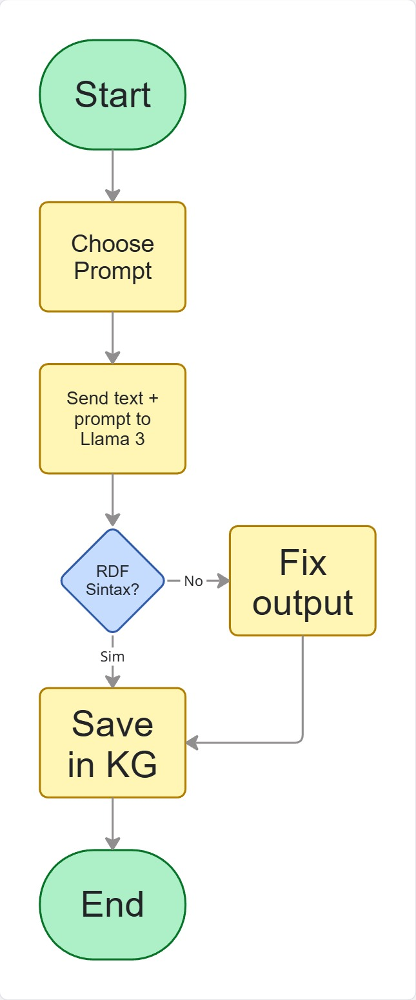
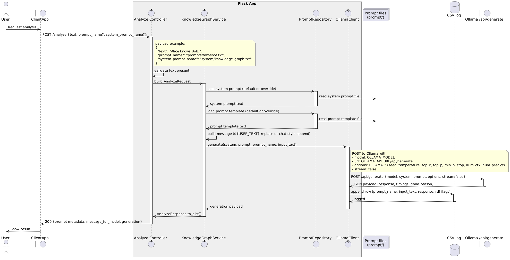

# Prompt-based Knowledge Graph Construction API

Small Flask API that accepts text, pairs it with a few-shot prompt, and prepares it for downstream knowledge-graph extraction. The project ships with ready-to-use prompts and simple utilities to load them.

## Process Flow

## Project Layout
- `src/` - Flask API following a simple DDD layering
- `prompt/system/` - System prompts (LLM behavior/constraints).
- `prompt/prompts/` - Few-shot prompt templates (include `${USER_TEXT}` placeholder).
- `tests/` - Pytest suite for services and controllers.

## Sequence Diagram 

## LLM Configuration

| Variable                    | Description                               | Type                | Default/Example Value            |
|-----------------------------|-------------------------------------------|---------------------|----------------------------------|
| DEFAULT_PROMPT_NAME         | Path to the few-shot prompt               | String              | prompts/few-shot.txt             |
| DEFAULT_SYSTEM_PROMPT_NAME  | Path to the system prompt                 | String              | system/knowledge_graph.txt       |
| OLLAMA_API_URL              | Ollama API URL                            | String              | http://localhost:11434           |
| OLLAMA_MODEL                | LLM model name                            | String              | llama3:8b                        |
| OLLAMA_CSV_PATH             | Path to the response log CSV file         | String              | data/ollama_responses.csv        |
| OLLAMA_SEED                 | Seed for reproducibility                  | Integer (optional)  | -                                |
| OLLAMA_TEMPERATURE          | Sampling temperature                      | Float (optional)    | -                                |
| OLLAMA_TOP_K                | Top-K sampling                            | Integer (optional)  | -                                |
| OLLAMA_TOP_P                | Top-P (nucleus sampling)                  | Float (optional)    | -                                |
| OLLAMA_MIN_P                | Minimum probability threshold             | Float (optional)    | -                                |
| OLLAMA_STOP                 | Stop sequence                             | String (optional)   | -                                |
| OLLAMA_NUM_CTX              | Context window size                       | Integer (optional)  | -                                |
| OLLAMA_NUM_PREDICT          | Maximum number of tokens to generate      | Integer (optional)  | -                                |
